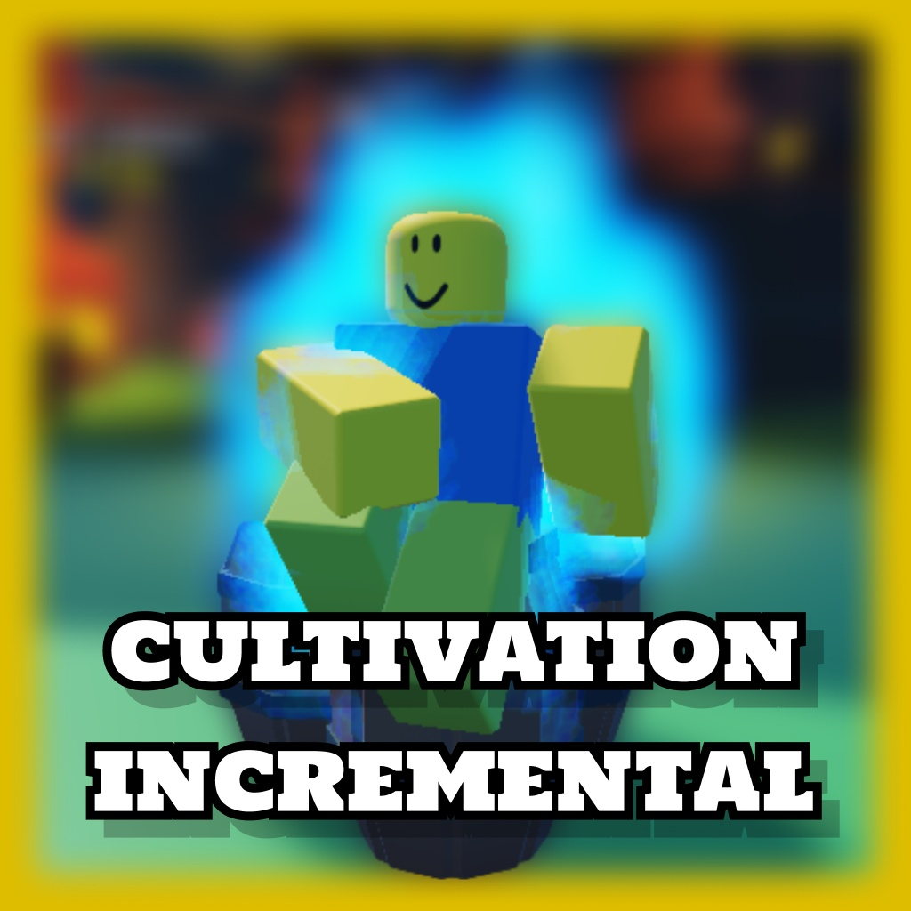

# Cultivation Incremental
A Roblox Incremental where players cultivate, kill mobs, collect spiritual stones, and breakthrough cultivation realm to reach immortality.

[Play Cultivation Incremental on Roblox (R16+ Currently)](https://www.roblox.com/games/128506264671282/Cultivation-Incremental)

## Quick Start
- Open the [Game](https://www.roblox.com/games/128506264671282/Cultivation-Incremental).
- Click play and start the game.
- Go to the nearest Zone (the one with the Floating Gui), and you'll automatically Gets Qi!
- Accept a Quest from an NPC with a (!) above their Head.

---

## Features
- Cultivation Realms Level & Breakthrough
- Combat & Questing
- Zones with higher Qi density
- Items to help cultivate

---

## Credits
- Rojo & Wally -- Modern Lua developer tooling.
- Leifstout -- Data Store. And more, check [Here](wally.toml) for depedency used.
- [Spirit Stone Asset](https://www.flaticon.com/free-icon/gems_3621938?related_id=3621888&origin=search)
- [Qi Asset](https://www.flaticon.com/free-icon/fire_1453025?term=fire&page=1&position=13&origin=search&related_id=1453025)
- And other artist that made the free models in Roblox.